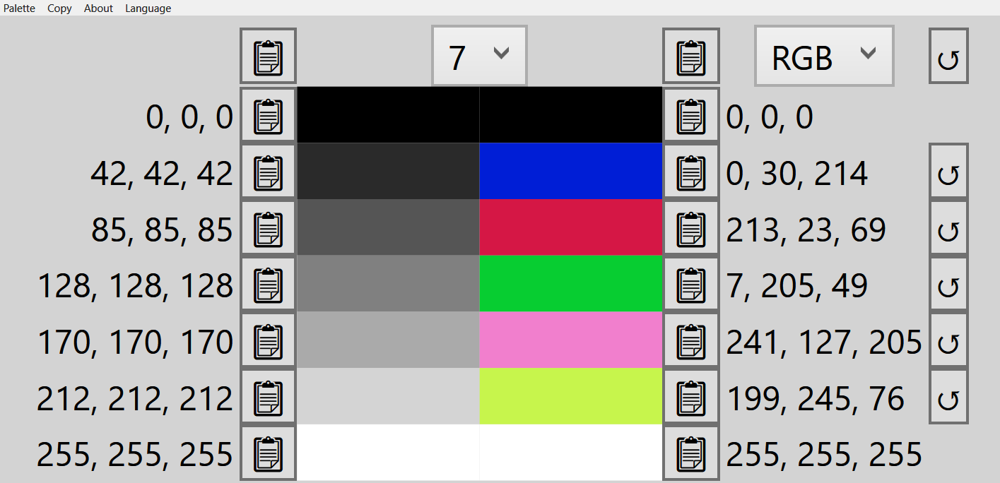
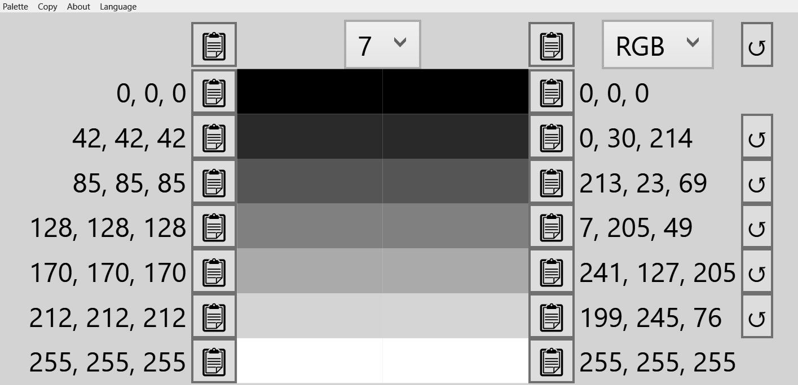


# Friendly Palette Generator

## What

**Friendly Palette Generator (FPG)** is a tool that generates color palettes based on grayscale values. 
It takes grayscale input (shades from black to white) and produces corresponding colors that match the input values.

| Regular       | Grayscale filter    |
|---------------------|---------------------|
|  |  |

### Features

- **Save and Load Palettes**: Easily save your custom palettes and load them when needed.
- **Copy Palette Values**: Copy generated palette values directly to your clipboard for quick use.
- **Multilingual Support**: Available in multiple languages, including English, Español, Deutsch, Português, Français, Italiano, 日本語, 한국어, 中文, हिन्दी, and Русский.

## Why

Colors that appear distinct to one person can be challenging to differentiate for individuals with color vision deficiencies or in specific visual conditions. 
FPG's color palettes are designed to be distinguishable, making them accessible to a broader range of users.

## Build

FPG is a Windows Presentation Foundation application which requires [.NET 8.0](https://dotnet.microsoft.com/en-us/download/dotnet/8.0).

To build the application for different architectures, use the following commands:
- **64 bit**: `dotnet publish -r win-x64 -p:PublishSingleFile=true --self-contained false`
- **32 bit**: `dotnet publish -r win-x86 -p:PublishSingleFile=true --self-contained false`
- **ARM**: `dotnet publish -r win-arm64 -p:PublishSingleFile=true --self-contained false`

---

